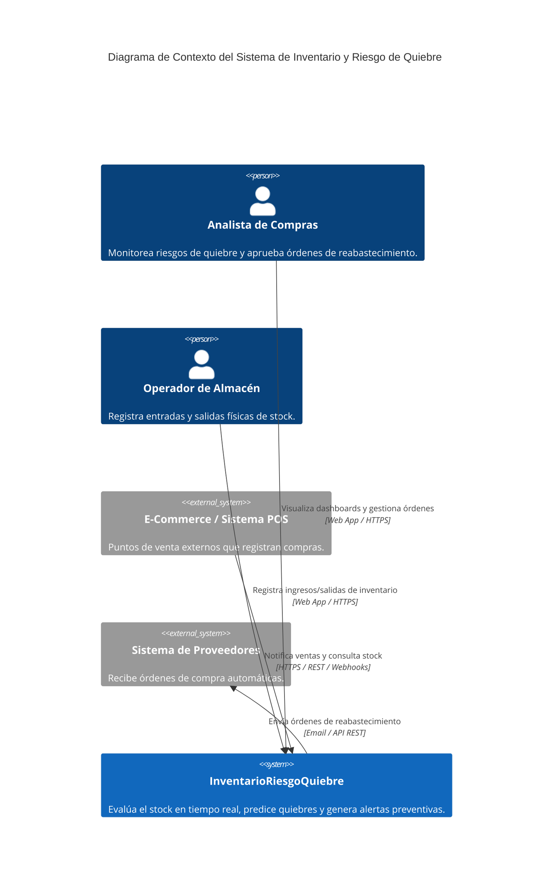
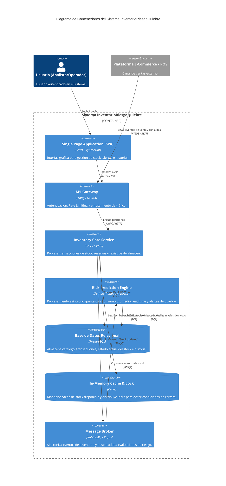
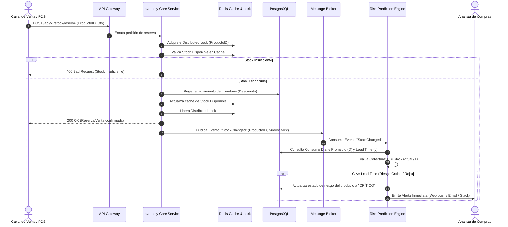

# Inventario y Riesgo de Quiebre (InventarioRiesgoQuiebre)

Sistema enterprise para la predicción, alerta temprana y gestión automatizada del riesgo de quiebre de stock (*out-of-stock*) en redes logísticas e inventarios.

---

## 1. 🎯 Objetivo, Actores y Alcance

### Objetivo
Diseñar e implementar un sistema distribuido e inteligente capaz de predecir el agotamiento de stock en tiempo real, calcular los niveles de reabastecimiento óptimos y emitir alertas preventivas automatizadas para minimizar las pérdidas financieras por ventas no concretadas.

### Actores
* **Gestor de Inventario / Analista de Compras:** Supervisa el inventario, revisa alertas de riesgo de quiebre y aprueba/emite órdenes de compra a proveedores.
* **Operador de Almacén:** Registra entradas, salidas y ajustes físicos de productos.
* **Cliente / Canal de Ventas (E-Commerce/POS):** Consume disponibilidad de stock mediante compras en tiempo real.
* **Proveedor (Externo):** Recibe las órdenes de reabastecimiento y confirma fechas de entrega (*lead times*).
* **Administrador del Sistema:** Gestiona la configuración de parámetros globales, usuarios, accesos e integraciones.

### Alcance
* **Dentro del Alcance:**
  * Control de inventario en tiempo real multi-almacén.
  * Motor de análisis del riesgo de quiebre basado en consumo promedio diario ($D$), *lead times* ($L$) y stock de seguridad ($SS$).
  * Notificación automática multicanal (Email, Webhooks, Slack) ante alertas críticas.
  * Generación de recomendaciones automáticas de órdenes de reabastecimiento.
  * Integración vía API REST/Eventos con canales de venta externos.
* **Fuera del Alcance:**
  * Facturación electrónica y contabilidad completa.
  * Gestión directa de flotillas de transporte o rutas de entrega física (*Routing/Fleet Management*).

---

## 2. 📋 Requisitos Funcionales y de Calidad

### Requisitos Funcionales (RF)
* **RF-01 (Monitoreo de Stock):** El sistema debe registrar movimientos de entrada, salida y reserva de stock con latencia menor a 1 segundo.
* **RF-02 (Motor de Evaluación de Riesgo):** El sistema debe evaluar automáticamente cada $N$ minutos o tras cada venta los Días de Cobertura ($C = \frac{\text{Stock Actual}}{\text{Consumo Diario Promedio}}$) y clasificar el riesgo en Verde, Amarillo o Rojo.
* **RF-03 (Generación de Alertas):** Disparar alertas inmediatas al equipo de compras cuando $C \le \text{Lead Time del Proveedor}$.
* **RF-04 (Recomendación de Pedidos):** Calcular y generar borradores de órdenes de compra especificando la Cantidad Económica de Pedido ($EOQ$).
* **RF-05 (Auditoría e Histórico):** Registrar la trazabilidad e historial inmutable de todas las variaciones de stock y ajustes manuales.

### Requisitos de Calidad / No Funcionales (RNF)
* **RNF-01 (Disponibilidad):** Garantizar un uptime del $99.9\%$ ($24/7$) para no interferir con las operaciones de ventas en tiempo real.
* **RNF-02 (Rendimiento/Escalabilidad):** Procesar al menos $1,000$ transacciones de actualización de stock por segundo (TPS) con un tiempo de respuesta P95 $< 200\text{ ms}$.
* **RNF-03 (Consistencia de Datos):** Evitar sobreventas (*over-selling*) aplicando consistencia fuerte en la gestión de reservas de inventario.
* **RNF-04 (Seguridad):** Autenticación y autorización basada en roles (RBAC) con cifrado en tránsito (TLS 1.3) y en reposo (AES-256).

---

## 3. 📐 Diagramas C4

### Nivel 1: Diagrama de Contexto

### Nivel 2: Diagrama de Contenedores

---

## 4. 🔄 Flujo de una Operación Crítica: Actualización de Inventario y Detección de Riesgo de Quiebre

A continuación se detalla la secuencia operativa al registrarse una venta masiva o actualización de stock:

---

## 5. 🛠️ Stack Propuesto y Justificación

| Componente | Tecnología | Justificación |
| :--- | :--- | :--- |
| **Frontend** | React + TypeScript | Proporciona un desarrollo robusto con verificación de tipos en tiempo de compilación y excelente ecosistema para componentes de dashboard e indicadores de estado en vivo. |
| **Backend Core** | Go (Golang) | Alta concurrencia nativa (goroutines), bajísimo consumo de memoria y ejecución ultra-rápida para el manejo de transacciones de stock con alto throughput. |
| **Motor de Análisis/Riesgo** | Python (FastAPI / Celery) | Extensa disponibilidad de librerías científicas y estadísticas (Pandas, NumPy) ideal para cálculos cuantitativos de consumo y reabastecimiento. |
| **Base de Datos** | PostgreSQL | Soporte completo para transacciones ACID, integridad referencial estricta para inventario financiero y extensiones avanzadas de particionamiento. |
| **Caché / Lock** | Redis | Manejo de estructuras en memoria con tiempos de respuesta sub-milisegundo. Permite bloqueos distribuidos (Redlock) para evitar sobreventas concurrentes. |
| **Message Broker** | RabbitMQ | Excelente soporte para mensajería AMQP, garantizando entrega ordenada, patrón *pub/sub* y desacoplamiento entre el núcleo transaccional y el motor de alertas. |

---

## 6. 📝 Arquitectura y Decisiones (ADRs)

### ADR 001: Adopción de Modelo Event-Driven para la Evaluación de Riesgo
* **Estatus:** Aprobado
* **Contexto:** El cálculo de riesgo de quiebre requiere consultar datos históricos de ventas, métricas agregadas y patrones de proveedores. Ejecutar este cálculo síncronamente durante la transacción de compra degradaría significativamente el tiempo de respuesta del checkout.
* **Decisión:** Desacoplar el procesamiento transaccional del cálculo de riesgo mediante una Arquitectura Dirigida por Eventos (*Event-Driven*). El servicio core publica un evento `StockChanged`, el cual es procesado de forma asíncrona por el *Risk Prediction Engine*.
* **Consecuencias:**
  * *Positivas:* Tiempos de respuesta inmediatos ($<50\text{ ms}$) en la API de ventas. Alta resiliencia del sistema ante picos de demanda.
  * *Negativas:* Introducción de consistencia eventual en la actualización del tablero de alertas de quiebre (latencia de pocos segundos).

---

### ADR 002: Uso de Redis para Bloqueo Distribuido (Redlock) en Reservas de Stock
* **Estatus:** Aprobado
* **Contexto:** En escenarios de alto tráfico (p. ej., eventos de ventas especiales), múltiples peticiones concurrentes intentan descontar las últimas unidades del mismo producto simultáneamente, provocando condiciones de carrera y quiebres no detectados (sobreventas).
* **Decisión:** Implementar un mecanismo de *Distributed Lock* utilizando Redis previa transacción en la base de datos principal.
* **Consecuencias:**
  * *Positivas:* Garantiza atomicidad estricta y previene el "race condition" sin sobrecargar la base de datos PostgreSQL con locks a nivel de fila.
  * *Negativas:* Requiere mantener y monitorear un clúster de Redis con alta disponibilidad para evitar un punto único de falla.

---

## 7. ⚠️ Riesgos y Estrategias de Mitigación

1. **Riesgo 1: Picos Inesperados de Demanda (Efecto "Flash Sale")**
   * *Impacto:* Agotamiento repentino del stock antes de que el motor de alertas complete la notificación, provocando quiebres no anticipados.
   * *Mitigación:* Implementar un algoritmo de detección de anomalías de consumo a corto plazo que evalúe la tasa de variación ($\Delta D / \Delta t$) cada 5 minutos en lugar de depender únicamente promedios diarios históricos.

2. **Riesgo 2: Datos Inexactos del Lead Time del Proveedor**
   * *Impacto:* Si un proveedor se retrasa constantemente en sus entregas, las alertas se emitirán tarde y ocurrirá un quiebre efectivo.
   * *Mitigación:* Incorporar un factor de corrección dinámico para el *Lead Time* ($L_{real} = L_{teorico} + \text{Varianza Historica}$), ajustando dinámicamente el Stock de Seguridad ($SS$).

3. **Riesgo 3: Inconsistencia entre Caché (Redis) y Base de Datos (PostgreSQL)**
   * *Impacto:* Mostrar stock disponible falso al cliente o dar falsas alarmas de quiebre.
   * *Mitigación:* Establecer un patrón *Write-Through* / *Cache-Aside* estricto con reconciliación automática mediante tareas programadas (*cron-jobs*) nocturnas y tiempos de expiración (TTL) breves en el caché.

---

## 8. 📊 Métricas Clave

### Métrica de Negocio
* **Tasa de Quiebre de Stock Evitado (Out-of-Stock Prevention Rate - OOSPR):**
  $$\text{OOSPR} = \left( \frac{\text{Alertas Críticas Atendidas a Tiempo}}{\text{Total de Alertas Críticas Generadas}} \right) \times 100$$
  * *Meta:* $> 95\%$. Mide la efectividad operativa del sistema para convertir una alerta preventiva en una orden de reabastecimiento antes de que el stock llegue a $0$.

### Métrica Técnica
* **Latencia del Pipeline de Procesamiento de Eventos (Event Processing Latency):**
  * Mide el tiempo transcurrido desde que se publica el evento `StockChanged` en el Message Broker hasta que el `Risk Prediction Engine` completa la re-evaluación del nivel de riesgo.
  * *Meta:* P99 $< 1,000\text{ ms}$ (1 segundo).
